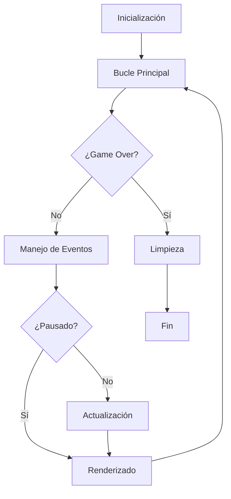
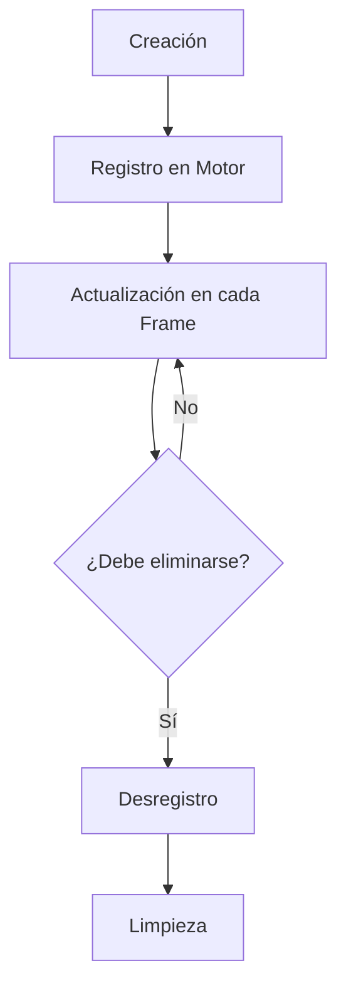

# Guía del Motor de Juego

Este documento describe la arquitectura, el ciclo de vida y los patrones de diseño utilizados en el motor de juego. La arquitectura sigue el **Principio de Hollywood** ("No nos llames, nosotros te llamaremos") para mantener un control de flujo claro y organizado.

## Índice

1. [Arquitectura General](#arquitectura-general)
2. [Jerarquía de Clases](#jerarquía-de-clases)
3. [Ciclo de Vida del Motor](#ciclo-de-vida-del-motor)
4. [Ciclo de Vida de los Objetos del Juego](#ciclo-de-vida-de-los-objetos-del-juego)
5. [Sistema de Eventos](#sistema-de-eventos)
6. [Sistema de Renderizado](#sistema-de-renderizado)
7. [Sistema de Colisiones](#sistema-de-colisiones)
8. [Sistema Delta Time](#sistema-delta-time)
9. [Gestión de Recursos](#gestión-de-recursos)
10. [Patrones de Diseño Implementados](#patrones-de-diseño-implementados)
11. [Buenas Prácticas](#buenas-prácticas)

## Arquitectura General

El motor utiliza una arquitectura en capas que separa claramente las responsabilidades:

```
┌─────────────────────────────────────────┐
│ Juego Específico (SpaceShooterGame)     │
├─────────────────────────────────────────┤
│ Motor del Juego (GameEngine)            │
├─────────────────────────────────────────┤
│ Objetos del Juego (GameObject)          │
├─────────────────────────────────────────┤
│ Pygame                                  │
└─────────────────────────────────────────┘
```

Esta arquitectura garantiza:

- **Separación de responsabilidades**: Cada capa tiene una función clara
- **Extensibilidad**: Fácil creación de nuevos juegos o entidades
- **Reutilización**: Componentes genéricos para diferentes juegos

## Jerarquía de Clases

### GameEngine

La clase base para crear motores de juego. Maneja el bucle principal, eventos, actualización y renderizado.

**Atributos principales:**

- `objects_manager`: Gestiona todos los objetos registrados
- `game_surface`: Superficie virtual para el nivel
- `game_window`: Ventana principal de Pygame
- `debug_mode`: Controla la visualización de hitboxes y estadísticas
- `clock`: Reloj para controlar FPS

**Métodos principales:**

- `run()`: Bucle principal del juego
- `process_events()`: Procesa eventos de Pygame
- `update()`: Actualiza la lógica del juego
- `render()`: Renderiza todos los elementos
- `register_object()/unregister_object()`: Gestiona objetos
- `emit_event()`: Sistema de eventos para comunicación

### GameObject

La clase base para todos los objetos del juego. Proporciona funcionalidad común como hitboxes, visibilidad, colisiones, etc.

**Atributos principales:**

- `x, y`: Posición del objeto
- `speed_x, speed_y`: Velocidad en cada eje
- `type`: Tipo de objeto para clasificación
- `hitbox`: Rectángulo de colisión
- `hitbox_data`: Configuración precisa del hitbox
- `image`: Imagen visual del objeto

**Métodos principales:**

- `update()`: Actualiza posición y estado
- `on_update()`: Lógica específica por tipo de objeto
- `set_hitbox_data()`: Configura el hitbox personalizado
- `collides_with()`: Detecta colisiones con otros objetos
- `draw()`: Renderiza el objeto
- `on_collide()`: Responde a colisiones

### Clases Derivadas

- **Player**: Lógica específica del jugador
- **Meteor**: Comportamiento de meteoritos
- **Missile**: Comportamiento de proyectiles

## Ciclo de Vida del Motor



### Fases del Ciclo de Vida

1. **Inicialización (`__init__` y `init_game`)**

   - Configuración de ventana y recursos
   - Creación de objetos iniciales
   - Registro de objetos en el motor
   - Inicialización de DeltaTime

2. **Bucle Principal (`run`)**

   - Control de FPS
   - Gestión del ciclo de juego
   - Actualización de DeltaTime

3. **Manejo de Eventos (`process_events`)**

   - Eventos de sistema (cierre, redimensión)
   - Eventos de entrada (teclado, ratón)
   - Teclas especiales (P para pausa, F3 para modo debug)
   - Eventos personalizados

4. **Actualización (`update`)**

   - Actualización de objetos registrados
   - Detección de colisiones
   - Lógica específica del juego
   - Limpieza de objetos marcados para destrucción

5. **Renderizado (`render`)**

   - Dibujado de fondo
   - Dibujado de objetos
   - Dibujado de hitboxes (modo depuración)
   - Dibujado de UI y estadísticas
   - Escalado del área virtual a la ventana real

6. **Limpieza (`cleanup`)**
   - Liberación de recursos
   - Cierre de sistema

## Ciclo de Vida de los Objetos del Juego



### Fases del Ciclo de Vida de Objetos

1. **Creación (`__init__`)**

   - Configuración inicial (posición, tipo)
   - Configuración de hitbox personalizado
   - Carga de imagen
   - Inicialización de velocidad y rotación

2. **Registro en Motor (`register_object`)**

   - Añade el objeto a la lista de objetos gestionados
   - Establece referencia al juego

3. **Actualización (`update` -> `on_update`)**

   - Movimiento basado en delta time
   - Rotación (si es necesaria)
   - Actualización de hitbox
   - Actualización específica (`on_update`)

4. **Renderizado (`draw`)**

   - Dibujado condicionado por visibilidad
   - Dibujado de hitbox en modo debug

5. **Colisiones (`detect_collisions` -> `on_collide`)**

   - Detección de intersección de hitboxes
   - Notificación a ambos objetos implicados
   - Lógica específica en `on_collide`

6. **Desregistro y Eliminación (`unregister_object`)**
   - Marcado para eliminación (`should_destroy`)
   - Eliminación de la lista de objetos
   - Liberación de recursos

## Sistema de Eventos

El sistema de eventos sigue una cadena de responsabilidad:

```
┌───────────────────┐
│ Pygame Events     │
└───────┬───────────┘
        ▼
┌───────────────────┐
│ GameEngine        │ ◄─── Eventos base (QUIT, F3, etc.)
└───────┬───────────┘
        ▼
┌───────────────────┐
│ SpaceShooterGame  │ ◄─── Eventos específicos del juego
└───────────────────┘
```

El motor implementa:

- `process_events()`: Procesa eventos del sistema
- `on_handle_event()`: Hook para eventos específicos del juego
- `emit_event()`: Emite eventos a objetos registrados

Eventos importantes:

- `player_fire_missile`: Creación de misiles
- `meteor_destroyed`: Meteorito destruido
- `game_over`: Fin del juego

## Sistema de Renderizado

El sistema de renderizado sigue un patrón de capas:

```
┌─────────────────────────────────────────┐
│ Background (Fondo del juego)            │
├─────────────────────────────────────────┤
│ Game Objects (Objetos del juego)        │
├─────────────────────────────────────────┤
│ Debug (Hitboxes si están activadas)     │
├─────────────────────────────────────────┤
│ Foreground (UI, efectos, HUD)           │
└─────────────────────────────────────────┘
```

Características importantes:

- **Área virtual**: El juego se renderiza en una superficie virtual (`game_surface`)
- **Escalado**: Esta superficie se escala a la ventana real
- **HUD separado**: El HUD se renderiza directamente en la ventana principal
- **Modo debug**: Información técnica como FPS, hitboxes, etc.

## Sistema de Colisiones

El sistema de colisiones utiliza hitboxes rectangulares personalizables:

```
┌─────────────────┐
│                 │
│    Sprite       │   ┌──────┐
│                 │   │Hitbox│
│                 │   └──────┘
└─────────────────┘
```

Características:

- **Hitboxes configurables**: Ancho, alto y offset desde el centro
- **Datos desde JSON**: Configuración cargada desde `entities_config.json`
- **Modo Debug**: Visualización de hitboxes y puntos centrales
- **Detección eficiente**: Solo verifica colisiones entre objetos activos
- **Respuesta por tipo**: Diferentes reacciones según el tipo de objetos

## Sistema Delta Time

El sistema Delta Time asegura un movimiento consistente independientemente de los FPS:

```python
# En vez de:
x += 5  # 5 píxeles por frame (inconsistente con FPS variables)

# Se usa:
x += speed * DeltaTime.get_delta()  # Consistente a cualquier FPS
```

Características:

- **Independencia de FPS**: Movimiento consistente a cualquier velocidad de fotogramas
- **Singleton estático**: Accesible desde cualquier parte del código
- **Límite de delta**: Evita saltos grandes durante lag

## Gestión de Recursos

El `ResourceManager` proporciona carga y caché de recursos:

- **Imágenes**: Carga, escalado y caché con transparencia
- **Sonidos**: Carga y reproducción
- **Fuentes**: Gestión de fuentes con tamaños específicos

## Patrones de Diseño Implementados

### Patrón Hollywood ("Don't call us, we'll call you")

El motor llama a los métodos de los objetos, no al revés.

- **Motor → update() → on_update()**
- **Motor → render() → on_render_background() → on_render_foreground()**

### Patrón Observer

Objetos se registran en el motor y reciben notificaciones.

- **register_object()**
- **unregister_object()**
- **emit_event()**

### Patrón Template Method

Define el esqueleto de un algoritmo en un método, delegando algunos pasos a las subclases.

- **update() → on_update()**
- **render() → on_render_background() → on_render_foreground()**

### Patrón Singleton

Clases con instancia única y acceso global.

- **Config**: Configuración del juego
- **DeltaTime**: Gestión de tiempo entre frames

## Buenas Prácticas

1. **No sobrescribir métodos base**

   - Implementar `on_update()` en lugar de `update()`
   - Implementar `on_render_background()` y `on_render_foreground()` en lugar de `render()`

2. **Gestión de recursos**

   - Registrar objetos al crearlos
   - Desregistrar objetos al destruirlos
   - Usar DeltaTime para movimiento

3. **Separación de responsabilidades**

   - El motor gestiona el ciclo de vida
   - Los objetos implementan su comportamiento específico
   - La configuración se carga desde archivos externos (JSON)

4. **Evitar acoplamiento**

   - Usar interfaces claras entre capas
   - Utilizar el sistema de eventos para comunicación
   - Evitar dependencias circulares
