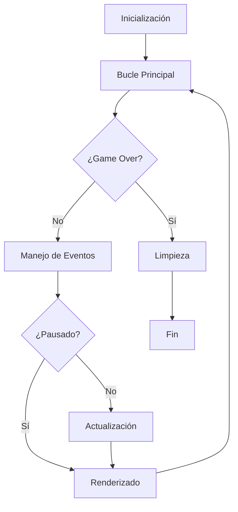
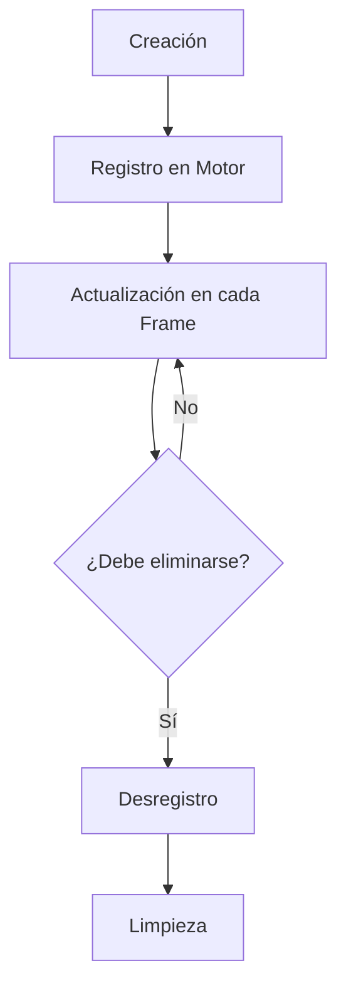

# Guía del Motor de Juego

Este documento describe la arquitectura, el ciclo de vida y los patrones de diseño utilizados en el motor de juego. La arquitectura sigue el **Principio de Hollywood** ("No nos llames, nosotros te llamaremos") para mantener un control de flujo claro y organizado.

## Índice

1. [Arquitectura General](#arquitectura-general)
2. [Jerarquía de Clases](#jerarquía-de-clases)
3. [Ciclo de Vida del Motor](#ciclo-de-vida-del-motor)
4. [Ciclo de Vida de los Objetos del Juego](#ciclo-de-vida-de-los-objetos-del-juego)
5. [Sistema de Eventos](#sistema-de-eventos)
6. [Sistema de Renderizado](#sistema-de-renderizado)
7. [Sistema de Colisiones](#sistema-de-colisiones)
8. [Patrones de Diseño Implementados](#patrones-de-diseño-implementados)
9. [Buenas Prácticas](#buenas-prácticas)

## Arquitectura General

El motor utiliza una arquitectura en capas que separa claramente las responsabilidades:

```
┌─────────────────────────────────────────┐
│ Juego Específico (SpaceShooterGame)     │
├─────────────────────────────────────────┤
│ Motor del Juego (GameEngine)            │
├─────────────────────────────────────────┤
│ Objetos del Juego (GameObject)          │
├─────────────────────────────────────────┤
│ Pygame                                  │
└─────────────────────────────────────────┘
```

Esta arquitectura garantiza:

- **Separación de responsabilidades**: Cada capa tiene una función clara
- **Extensibilidad**: Fácil creación de nuevos juegos o entidades
- **Reutilización**: Componentes genéricos para diferentes juegos

## Jerarquía de Clases

### GameEngine

La clase base para crear motores de juego. Maneja el bucle principal, eventos, actualización y renderizado.

### GameObject

La clase base para todos los objetos del juego. Proporciona funcionalidad común como hitboxes, visibilidad, colisiones, etc.

### Clases Derivadas

- **Player**: Lógica específica del jugador
- **Meteor**: Comportamiento de meteoritos
- **Missile**: Comportamiento de proyectiles

## Ciclo de Vida del Motor



### Fases del Ciclo de Vida

1. **Inicialización (`__init__` y `init_game`)**

   - Configuración de ventana y recursos
   - Creación de objetos iniciales
   - Registro de objetos en el motor

2. **Bucle Principal (`run`)**

   - Control de FPS
   - Gestión del ciclo de juego

3. **Manejo de Eventos (`handle_events`)**

   - Eventos de sistema (cierre, redimensión)
   - Eventos de entrada (teclado, ratón)
   - Eventos personalizados

4. **Actualización (`update`)**

   - Actualización de objetos registrados
   - Lógica específica del juego

5. **Renderizado (`render`)**

   - Dibujado de fondo
   - Dibujado de hitboxes (modo depuración)
   - Dibujado de objetos
   - Dibujado de UI

6. **Limpieza (`cleanup`)**
   - Liberación de recursos
   - Cierre de sistema

## Ciclo de Vida de los Objetos del Juego



### Fases del Ciclo de Vida de Objetos

1. **Creación (`__init__`)**

   - Configuración inicial
   - Carga de recursos
   - Definición de hitbox

2. **Registro en Motor (`register_object`)**

   - Añade el objeto a la lista de objetos gestionados

3. **Actualización (`update` -> `on_update`)**

   - Actualización común (`update`)
   - Actualización específica (`on_update`)

4. **Renderizado (`draw`)**

   - Dibujado condicionado por visibilidad

5. **Desregistro y Eliminación (`unregister_object`)**
   - Eliminación de la lista de objetos
   - Liberación de recursos

## Sistema de Eventos

El sistema de eventos sigue una cadena de responsabilidad:

```
┌───────────────────┐
│ Pygame Events     │
└───────┬───────────┘
        ▼
┌───────────────────┐
│ GameEngine        │ ◄─── Eventos base (QUIT, F3, etc.)
└───────┬───────────┘
        ▼
┌───────────────────┐
│ SpaceShooterGame  │ ◄─── Eventos específicos del juego
└───────────────────┘
```

El motor proporciona:

- **handle_events()**: Procesa eventos del sistema
- **process_event()**: Hook para eventos específicos del juego

## Sistema de Renderizado

El sistema de renderizado sigue un patrón de capas:

```
┌─────────────────────────────────────┐
│ Background (Fondo del juego)        │
├─────────────────────────────────────┤
│ Debug (Hitboxes si están activadas) │
├─────────────────────────────────────┤
│ Game Objects (Objetos del juego)    │
├─────────────────────────────────────┤
│ Foreground (UI, efectos, etc.)      │
└─────────────────────────────────────┘
```

El motor proporciona:

- **render()**: Gestión general del renderizado
- **on_render_background()**: Renderizado del fondo
- **on_render_foreground()**: Renderizado de elementos en primer plano

## Sistema de Colisiones

El sistema de colisiones utiliza hitboxes rectangulares:

```
┌─────────────┐
│             │
│    Sprite   │   ┌──────┐
│             │   │Hitbox│
│             │   └──────┘
└─────────────┘
```

Características:

- **Hitboxes ajustables**: Por escala o padding
- **Colisiones precisas**: Más pequeñas que los sprites
- **Depuración visual**: Modo para mostrar hitboxes

## Patrones de Diseño Implementados

### Patrón Hollywood

El motor llama a los métodos de los objetos, no al revés.

- **Motor → update() → on_update()**
- **Motor → render() → on_render_background() → on_render_foreground()**

### Patrón Observer

Objetos se registran en el motor y reciben notificaciones.

- **register_object()**
- **unregister_object()**

### Patrón Template Method

Define el esqueleto de un algoritmo en un método, delegando algunos pasos a las subclases.

- **update() → on_update()**
- **render() → on_render_background() → on_render_foreground()**

## Buenas Prácticas

1. **No sobrescribir métodos base**

   - Implementar `on_update()` en lugar de `update()`
   - Implementar `on_render_background()` y `on_render_foreground()` en lugar de `render()`

2. **Gestión de recursos**

   - Registrar objetos al crearlos
   - Desregistrar objetos al destruirlos

3. **Separación de responsabilidades**

   - El motor gestiona el ciclo de vida
   - Los objetos implementan su comportamiento específico

4. **Evitar acoplamiento**
   - Usar interfaces claras entre capas
   - Evitar dependencias circulares
