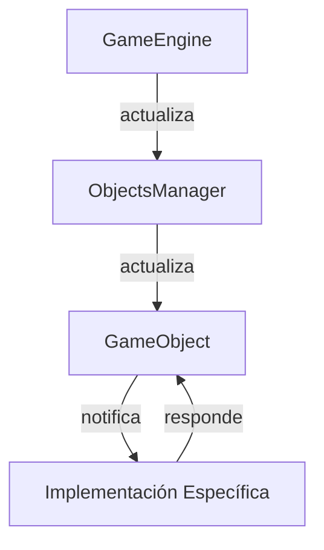

# Arquitectura del Motor

El motor de juego sigue una arquitectura por capas diseñada para proporcionar una base sólida y extensible para el desarrollo de juegos en 2D. La separación clara de responsabilidades facilita la personalización y mantenimiento.

## Principios de Diseño

La arquitectura del motor se basa en los siguientes principios:

1. **Separación de responsabilidades**: Cada clase tiene un propósito claro y específico
2. **Extensibilidad**: Facilidad para extender el motor para crear juegos específicos
3. **Inversión de control**: El motor controla el flujo de la aplicación (Principio de Hollywood)
4. **Encapsulación**: Los detalles de implementación están ocultos tras interfaces claras

## Estructura de Capas

El motor está organizado en capas, donde cada capa depende únicamente de las capas inferiores:

```
┌─────────────────────────────────────────┐
│ Juego Específico                        │ Implementación de juego concreto
├─────────────────────────────────────────┤
│ Motor del Juego                         │ Bucle principal, Eventos, Renderizado
├─────────────────────────────────────────┤
│ Gestión de Objetos y Recursos           │ Administración de objetos y recursos
├─────────────────────────────────────────┤
│ Objetos del Juego                       │ Base para entidades del juego
├─────────────────────────────────────────┤
│ Pygame                                  │ Biblioteca base de gráficos y eventos
└─────────────────────────────────────────┘
```

## Componentes Principales

### 1. GameEngine (Motor de Juego)

Esta clase implementa:

- Bucle principal del juego
- Sistema de eventos
- Control de tiempo (FPS)
- Inicialización y limpieza

Actúa como el coordinador central del juego, orquestando todos los demás componentes.

### 2. ObjectsManager (Gestor de Objetos)

Responsable de:

- Registro y seguimiento de objetos del juego
- Detección de colisiones
- Propagación de eventos a los objetos
- Consultas sobre objetos (filtrado, conteo, etc.)

### 3. ResourceManager (Gestor de Recursos)

Maneja:

- Carga de imágenes
- Carga de sonidos
- Carga de fuentes
- Gestión de la memoria de recursos

### 4. GameObject (Objeto del Juego)

Base para todas las entidades del juego:

- Sistema de hitboxes
- Rotación
- Visibilidad
- Manejo de colisiones

## Flujo de Control

El flujo de control en el motor sigue el patrón de Hollywood ("No nos llames, nosotros te llamaremos"):

1. El motor llama a métodos específicos de las clases derivadas en momentos determinados
2. Las clases derivadas implementan estos métodos para personalizar el comportamiento
3. El control del flujo principal siempre está en manos del motor



## Extensibilidad

El motor está diseñado para ser extendido principalmente de dos formas:

1. **Herencia**: Crear nuevas clases que hereden de las clases base

   - `SpaceShooterGame` extiende `GameEngine`
   - `Player`, `Meteor`, etc. extienden `GameObject`

2. **Composición**: Añadir funcionalidad a través de composición
   - `GameEngine` contiene `ObjectsManager` y `ResourceManager`
   - `GameObject` puede contener otros objetos

## Puntos de Extensión

El motor proporciona varios "hooks" o puntos de extensión donde las implementaciones específicas pueden personalizar el comportamiento:

- `on_update()`: Lógica de actualización específica
- `on_render_background()`: Renderizado de fondo específico
- `on_render_foreground()`: Renderizado de primer plano específico
- `on_handle_event()`: Manejo de eventos específico
- `on_game_event()`: Manejo de eventos de juego específico

## Ventajas de la Arquitectura

1. **Reutilización**: Los componentes base pueden reutilizarse para diferentes juegos
2. **Mantenibilidad**: Estructura clara y separación de responsabilidades
3. **Escalabilidad**: Fácil ampliación con nuevos sistemas y funcionalidades
4. **Testabilidad**: Componentes desacoplados que facilitan las pruebas unitarias
