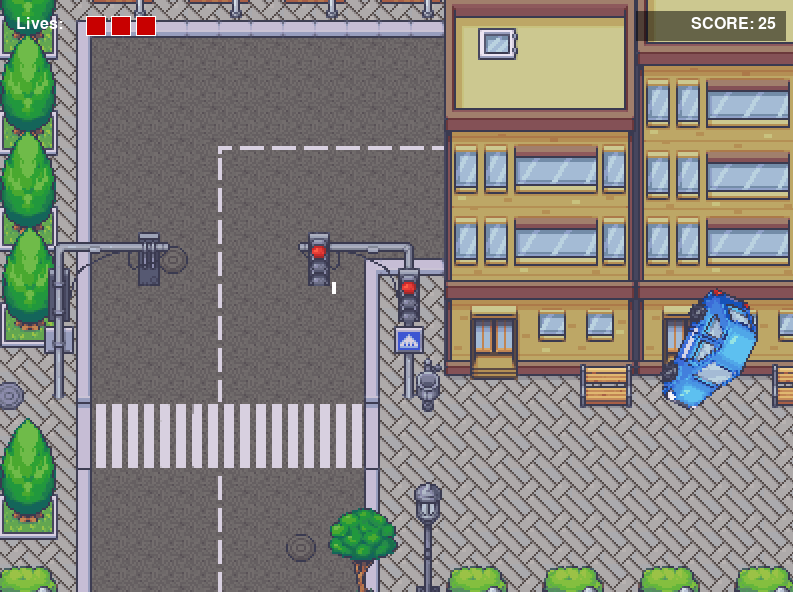

# Universidad Católica Andrés Bello

## Facultad de Ingeniería

### Escuela de Ingeniería Informática

#### Periodo Académico 2022-2023

\newpage

# Implementación de un Sistema Multijugador para Space Shooter



**Asignatura:** Programación de Videojuegos  
**Profesor:** Nombre del Profesor  
**Estudiante:** Nombre del Estudiante

\newpage

\tableofcontents

\newpage

## Introducción

Space Shooter es un juego de tipo arcade desarrollado en Python utilizando la biblioteca Pygame, donde el jugador controla una nave espacial y debe esquivar y destruir meteoritos que caen desde la parte superior de la pantalla. Originalmente desarrollado como un juego para un solo jugador, este proyecto busca ampliar sus características para permitir la modalidad multijugador.

El objetivo principal es transformar la experiencia de juego individual en una experiencia multijugador cooperativa, donde múltiples jugadores puedan unirse a una misma partida para enfrentar juntos la amenaza de los meteoritos. Para lograr esto, se implementará una arquitectura cliente-servidor, donde un servidor desarrollado en Go gestionará la lógica del juego y la comunicación entre los clientes mediante gRPC.

Este informe detalla el proceso de análisis, diseño e implementación del sistema multijugador para Space Shooter, abordando los desafíos técnicos y las soluciones propuestas.

## Análisis del Problema

### Estado Actual del Juego

El juego Space Shooter en su versión original es una aplicación monolítica para un solo jugador que ejecuta toda la lógica del juego en un mismo proceso. El juego cuenta con los siguientes componentes principales:

- **Motor del juego**: Gestiona el bucle principal, la detección de colisiones y el renderizado.
- **Gestor de objetos**: Administra la creación, actualización y destrucción de entidades del juego.
- **Sistema de tiempo delta**: Asegura que el movimiento de los objetos sea consistente independientemente de la velocidad de cuadros.
- **Entidades**: Clases que representan al jugador, meteoritos, misiles y otros elementos del juego.
- **Gestor de meteoritos**: Controla la generación y comportamiento de los meteoritos.

### Desafíos de la Implementación Multijugador

La transformación del juego en un sistema multijugador implica afrontar varios desafíos técnicos:

1. **Sincronización de estado**: Mantener coherente el estado del juego entre todos los clientes conectados.
2. **Latencia de red**: Gestionar los retrasos en la comunicación para mantener una experiencia fluida.
3. **Autoridad del servidor**: Establecer el servidor como fuente de verdad para prevenir trampas o inconsistencias.
4. **Escalabilidad**: Diseñar el sistema para admitir múltiples jugadores simultáneos.
5. **Integración**: Adaptar el código existente para trabajar con la nueva arquitectura cliente-servidor.
6. **Interoperabilidad**: Garantizar la comunicación eficiente entre el cliente Python y el servidor Go.

### Requisitos del Sistema Multijugador

Para implementar un sistema multijugador funcional, se han establecido los siguientes requisitos:

- Permitir que múltiples jugadores se conecten a una misma sala de juego.
- Sincronizar la generación y movimiento de meteoritos entre todos los clientes.
- Transmitir las acciones de cada jugador a los demás participantes.
- Gestionar correctamente las colisiones y puntuaciones.
- Proporcionar un mecanismo para unirse a partidas en curso.
- Mantener la fluidez del juego minimizando el impacto de la latencia.

## Diseño de la Solución

### Arquitectura Cliente-Servidor

Para abordar los desafíos identificados, se ha optado por una arquitectura cliente-servidor:

- **Cliente (Python)**: Mantiene la interfaz gráfica, recibe eventos del servidor y envía acciones del jugador.
- **Servidor (Go)**: Gestiona la lógica del juego, sincroniza el estado entre clientes y actúa como autoridad final.
- **Comunicación (gRPC)**: Permite una comunicación eficiente y tipada entre cliente y servidor.

Esta separación permite centralizar la lógica crítica en el servidor, reduciendo la posibilidad de inconsistencias y facilitando la sincronización.

### Estructura del Proyecto

La estructura del proyecto se reorganizará para acomodar los nuevos componentes:

```
python-space-shooter/
|-- legacy/                    # Código anterior
|-- config.json                # Configuración general
|-- go-server/                 # Nuevo servidor Go
|   |-- main.go                # Punto de entrada
|   |-- proto/                 # Definiciones gRPC
|   |-- motor/                 # Motor del juego
|   |-- utils/                 # Utilidades
|   `-- space_shooter/         # Lógica específica
`-- python-game/               # Cliente Python
    `-- src/
        |-- menu/              # Menú del juego
        |-- motor/             # Motor del juego
        `-- space_shooter/     # Lógica específica
            `-- networking/    # Cliente gRPC
```

### Protocolo de Comunicación

La comunicación entre cliente y servidor se realizará mediante gRPC, utilizando Protocol Buffers para definir los mensajes. Se han definido los siguientes tipos de comunicación:

- **Unirse a partida**: El cliente solicita unirse y recibe un stream de eventos.
- **Envío de acciones**: El cliente envía las acciones del jugador al servidor.
- **Eventos del juego**: El servidor notifica a los clientes sobre meteoritos, misiles, colisiones, etc.
- **Estado del juego**: Sincronización completa del estado para nuevos jugadores.

### Flujos de Comunicación

Se han diseñado flujos específicos para las operaciones críticas:

#### Flujo de Unión a Partida

1. Cliente solicita unirse.
2. Servidor crea una sala si no existe o añade al jugador a una existente.
3. Servidor envía el estado actual al nuevo jugador.
4. Servidor notifica a todos los jugadores sobre el nuevo participante.

#### Flujo de Generación de Meteoritos

1. Servidor determina que es momento de crear un meteorito.
2. Servidor genera propiedades aleatorias y lo crea en su motor.
3. Servidor envía evento a todos los clientes con los datos del meteorito.
4. Clientes crean meteoritos idénticos localmente.

#### Flujo de Control del Jugador

1. Cliente detecta pulsación de tecla y envía acción al servidor.
2. Servidor actualiza la posición del jugador.
3. Servidor notifica a todos los clientes sobre el movimiento.
4. Clientes actualizan la posición del jugador correspondiente.

## Implementación

### Servidor Go

El servidor Go se ha estructurado en módulos que reflejan la organización del cliente Python original, facilitando la reimplementación de la lógica del juego:

```go
package utils

import (
    "sync"
    "time"
)

// DeltaTime mantiene el tiempo entre frames
type DeltaTime struct {
    lastTime  time.Time
    delta     float64
    maxDelta  float64
    baseFPS   float64
    mutex     sync.Mutex
}

// Update actualiza el delta time
func (dt *DeltaTime) Update() {
    dt.mutex.Lock()
    defer dt.mutex.Unlock()

    currentTime := time.Now()
    elapsed := currentTime.Sub(dt.lastTime).Seconds()

    // Limitar el delta máximo
    if elapsed > dt.maxDelta {
        elapsed = dt.maxDelta
    }

    dt.delta = elapsed
    dt.lastTime = currentTime
}
```

### Sistema de Networking en Python

Se ha implementado un gestor de networking en Python para comunicarse con el servidor Go:

```python
class NetworkingManager:
    def __init__(self, game):
        self.game = game
        self.channel = None
        self.player_id = None
        self.connected = False

    def connect(self, server_address, player_name):
        try:
            # Crear canal gRPC
            self.channel = grpc.insecure_channel(server_address)
            self.stub = spaceshooter_pb2_grpc.GameServiceStub(self.channel)

            # Iniciar stream de eventos
            join_request = spaceshooter_pb2.JoinRequest(player_name=player_name)
            self.event_stream = self.stub.JoinGame(join_request)

            # Iniciar hilo para procesar eventos
            self.event_thread = threading.Thread(target=self._process_events)
            self.event_thread.daemon = True
            self.event_thread.start()

            return True
        except Exception as e:
            print(f"Error al conectar: {e}")
            return False
```

### Modificaciones al Cliente Python

Se han realizado las siguientes modificaciones al cliente Python:

- Simplificación del menú para mostrar solo la opción "Unirse a partida".
- Adaptación del MeteorManager para recibir datos de meteoritos desde el servidor.
- Modificación del Player para enviar acciones al servidor.
- Implementación de la sincronización de estado entre jugadores.

### Gestión de Salas de Juego

El servidor es capaz de gestionar salas de juego, creando una nueva sala cuando un jugador intenta unirse y no hay ninguna sala activa, o añadiendo al jugador a una sala existente. Esto permite que múltiples jugadores se conecten a la misma partida.

## Pruebas – Ejecución


Las pruebas del sistema multijugador se dividirán en varias etapas:

1. **Pruebas unitarias**: Verificar el correcto funcionamiento de componentes individuales.
2. **Pruebas de integración**: Comprobar la comunicación entre cliente y servidor.
3. **Pruebas de carga**: Evaluar el comportamiento del sistema con múltiples clientes.
4. **Pruebas de latencia**: Analizar el impacto de la latencia en la jugabilidad.

## Conclusiones

La implementación de un sistema multijugador para Space Shooter representa un avance significativo en la evolución del juego, transformándolo de una experiencia individual a una colaborativa. Este proyecto ha demostrado los siguientes puntos clave:

- La arquitectura cliente-servidor es efectiva para sincronizar el estado del juego entre múltiples jugadores.
- gRPC proporciona una comunicación eficiente y tipada, ideal para juegos en tiempo real.
- La separación de la lógica del juego y la presentación facilita la implementación multijugador.
- Go es una elección adecuada para el servidor debido a su rendimiento y soporte para concurrencia.

Futuras mejoras podrían incluir:

- Implementación de predicción de movimiento para reducir el impacto de la latencia.
- Soporte para múltiples salas de juego simultáneas.
- Tablas de clasificación y estadísticas de jugadores.
- Modos de juego competitivos adicionales.

## Bibliografía

1. Pygame Community. (2023). Pygame Documentation. https://www.pygame.org/docs/
2. The Go Authors. (2023). The Go Programming Language. https://golang.org/doc/
3. gRPC Authors. (2023). gRPC Documentation. https://grpc.io/docs/
4. Protocol Buffers. (2023). Protocol Buffers Developer Guide. https://developers.google.com/protocol-buffers/docs/overview
